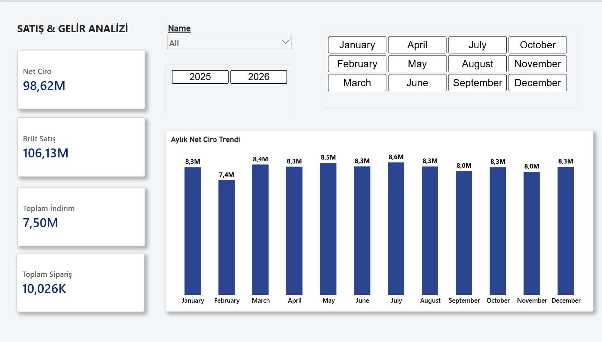
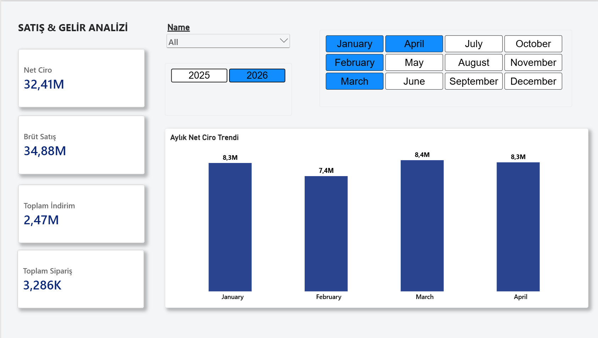

# MiniERP: Uçtan Uca Kurumsal Veritabanı ve İş Zekası Sistemi

> Satış, stok, tedarik ve cari hesap süreçlerini tek bir veri modelinde birleştiren; T-SQL ile kurgulanmış ilişkisel altyapı ve Power BI ile geliştirilmiş yönetici paneli.


---

## 🎯 Proje Amacı

Birçok işletmede satış, stok ve finans verisi birbirinden kopuk sistemlerde tutulur; bu da karar vericilerin güncel ve tutarlı bir tablo görmesini zorlaştırır.

MiniERP bu soruna iki katmanlı bir çözüm sunar:

1. **Veri katmanı:** Süreçleri güvenle yöneten, veri bütünlüğünü garanti altına alan ilişkisel veritabanı mimarisi.
2. **Analitik katman:** Aynı veriyi yöneticilerin operasyonel ve finansal kararlar alabileceği etkileşimli bir panoya dönüştüren raporlama modülü.

---

## 📊 Yönetici Paneli (Power BI)



| Analiz Alanı | Yanıtlanan İş Sorusu |
|---|---|
| **Gelir & Kârlılık** | Ciro, maliyet ve kâr marjı zaman içinde nasıl değişiyor? |
| **Stok & Tedarik** | Hangi ürünler kritik stok seviyesinde? Stok hareketleri nasıl seyrediyor? |
| **Cari Hesap Analitiği** | Hangi müşteri ve tedarikçiler finansal performansa en çok katkı sağlıyor? |

Tüm göstergeler, dinamik **DAX ölçümleriyle** modellenmiş Star Schema üzerinden beslenir ve filtrelere anlık yanıt verir.

---

## 💡 SQL ile Elde Edilen Bulgular

> Not: Proje, simülasyon amaçlı üretilmiş örnek veri seti üzerinde çalışır. Aşağıdaki sonuçlar `database/MiniERP.sql` içindeki view'lardan alınmıştır.

- **Ürün Performansı:** En yüksek ciroyu **ürün 98** getiriyor (3.596 adet, ~2,23 milyon net ciro). Onu ürün 94 (~2,21 milyon) ve ürün 99 (~2,12 milyon) izliyor.
- **Gelir Yoğunlaşması:** En çok ciro getiren ilk 3 ürün tek başına ~6,56 milyon net ciro üretiyor; ilk 8 ürünün toplamı ~16,48 milyon.
- **Müşteri Değeri:** Üst segmentteki müşteriler benzer ciro seviyesinde (~368,7 bin net ciro) ve ortalama %6,83 indirim alıyor.
- **İndirim Takibi:** Sipariş bazında brüt, indirim ve net tutarlar ayrıştırılarak kâr marjı üzerindeki indirim etkisi izlenebiliyor.

---

## 🗄️ Veritabanı Mimarisi



**Tasarım İlkeleri:**
- **İlişkisel Bütünlük:** 3NF'e uygun modüler tablolar, Foreign Key ve kısıtlarla (Constraints) korunan veri tutarlılığı.
- **İş Mantığı:** Stok, sipariş ve faturalama akışlarını yöneten Stored Procedure'ler; veri tutarsızlığını önleyen Transaction blokları.
- **Performans:** Execution plan analizleri ve indeksleme stratejileriyle desteklenen sorgular.

---

## 📁 Proje Yapısı
```
minierp/
├── assets/          # Yönetici paneli ve veritabanı mimari görselleri
├── database/        # T-SQL şemaları, tablo tanımları ve prosedürler (MiniERP.sql)
└── powerbi/         # Star Schema veri modeli ve interaktif rapor (MiniERP.pbix)
```
---

## 🚀 Kurulum

1. **Veritabanını oluşturun:** `database/MiniERP.sql` dosyasını SQL Server Management Studio (SSMS) ile açıp çalıştırın.
2. **Raporu açın:** `powerbi/MiniERP.pbix` dosyasını Power BI Desktop ile açın.
3. **Bağlantıyı güncelleyin:** Power BI'da *Dönüştür → Veri Kaynağı Ayarları* menüsünden sunucu adını kendi SQL Server örneğinizle değiştirin ve verileri yenileyin.

## 🛠️ Teknoloji Yığını

| Katman | Teknoloji |
|---|---|
| Veritabanı | Microsoft SQL Server, T-SQL |
| İş Zekası | Power BI, DAX |
| Versiyon Kontrolü | Git, GitHub |

---

## 👤 İletişim

**Kemalata Akıncı** ·
[LinkedIn](https://www.linkedin.com/in/kemalata-ak%C4%B1nc%C4%B1-66571936b/) · [E-posta](mailto:kemalata244@gmail.com)
